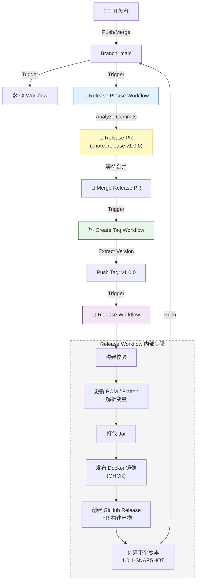

# 🤖 自动化工作流与发布机制

本项目采用全自动化的 CI/CD 流程，基于 GitHub Actions 和 Release Please 实现。本文档说明各个工作流的运作逻辑、交互关系及最佳实践。

## 🔄 工作流概览

项目包含以下核心工作流：

| 工作流文件 | 触发条件 | 职责 |
|:---|:---|:---|
| `ci.yml` | Push 到 `main`/`develop`，PR 到 `main` | **持续集成**：代码格式检查 (Spotless)、编译打包。Dependabot PR 仅做编译。 |
| `release-please.yml` | Push 到 `main`、PR 事件（更新 Release PR）、手动触发 | **发布提案**：分析 Commit 信息，自动更新 `CHANGELOG.md`、`.release-please-manifest.json` 和 `pom.xml`（release 版本），生成 Pull Request。 |
| `create-tag.yml` | Release Please 工作流完成后（检测到 Release PR 已合并）、或手动触发 | **版本打标**：从 manifest/CHANGELOG/pom 提取版本号，使用 `RELEASE_TOKEN` (PAT) 创建并推送 Git Tag（如 `v1.0.0`）。 |
| `release.yml` | Tag 推送 `v*`、或手动触发（可填版本号、可选跳过 Docker） | **正式发布**：构建校验 → 更新 POM/Flatten → 打包 Jar → **发布 Docker 镜像 (GHCR)** → 创建 GitHub Release → **自动升级下个快照版本**。 |
| `sync-labels.yml` | 手动触发 | **标签同步**：调用组织级可复用工作流，同步 GitHub Issue/PR 的标签配置。 |

## 🧩 自动化发布闭环逻辑

本项目实现了从代码合并到版本发布的完整闭环，无需人工干预版本号和 Tag。



### 详细流转过程

1.  **提交代码**：开发者遵循 [Conventional Commits](https://www.conventionalcommits.org/) 规范提交代码。
2.  **生成提案**：`release-please` 机器人分析 commit 记录。
    *   如果有 `feat` 提交，建议升级 Minor 版本 (1.0.0 -> 1.1.0)。
    *   如果有 `fix` 提交，建议升级 Patch 版本 (1.0.0 -> 1.0.1)。
    *   机器人创建一个 Release PR，包含：
        *   更新后的 `CHANGELOG.md`
        *   更新后的 `.github/.release-please-manifest.json`
        *   **更新后的 `pom.xml`（从 SNAPSHOT 改为正式版）**
3.  **合并发布**：维护者 Review 并合并 Release PR。
4.  **自动打标**：`create-tag` 在 Release Please 工作流完成后运行，若检测到本次为 Release PR 合并，则从 `.release-please-manifest.json`（优先）、`CHANGELOG.md` 或 `pom.xml` 提取版本号，使用 `RELEASE_TOKEN` (PAT) 创建并推送 Git Tag。支持 `workflow_dispatch` 手动重试。
    *   *注意：必须使用 PAT 推送 Tag 才能触发后续的 Release 工作流。*
5.  **构建与发布**：`release` 工作流被 Tag 触发（或手动触发并指定版本号）：
    *   构建校验（格式检查、编译）。
    *   将 `pom.xml` 中的 `${revision}` 替换为实际版本号，使用 `flatten-maven-plugin` 生成解析后的 POM。
    *   打包 Jar，并**构建并推送 Docker 镜像到 GitHub Container Registry (GHCR)**。
    *   创建 GitHub Release 并上传构建产物。
6.  **迭代闭环**：`release` 工作流最后会自动计算下一个 SNAPSHOT 版本（如 `1.0.1-SNAPSHOT`），并直接 Push 到 `main` 分支，为下一轮开发做好准备。

## ✅ 最佳实践

### 1. 提交规范 (Commit Convention)

这是自动化发布的基石。请务必遵循以下格式：

*   `feat: allow provided config object to extend other configs` -> **Minor**
*   `fix: array parsing issue when multiple spaces were contained in string` -> **Patch**
*   `perf: remove O(N) duplication search in initialization` -> **Patch**
*   `docs: correct spelling of CHANGELOG` -> **No Release**
*   `chore: bump deps` -> **No Release**
*   **Breaking Change**:
    ```text
    feat: rewrite API authentication
    
    BREAKING CHANGE: The token parameter is now required in the header.
    ```
    -> **Major**

### 2. Token 配置

为了让工作流能够相互触发（Chain Reaction），需要配置 Personal Access Token (PAT)。

*   **Secret Name**: `RELEASE_TOKEN`
*   **Permissions**: `repo` (Full control of private repositories) 或 `public_repo`
*   **原因**: GitHub 默认的 `GITHUB_TOKEN` 推送的代码或 Tag **不会** 触发其他 Workflow，以防止无限递归。使用 PAT 可以绕过此限制。

### 3. Maven 版本管理

本项目使用 `${revision}` 占位符管理版本，配合 `flatten-maven-plugin` 使用。

配置位于 `pom.xml` 和 `.github/release-please-config.json` 中。
`release-please` 通过 XPath `//*[local-name()='project']/*[local-name()='properties']/*[local-name()='revision']` 自动更新版本号。

*   **开发期**：`revision` 保持为 `x.y.z-SNAPSHOT`。
*   **发布期**：CI 脚本会动态将其修改为 `x.y.z` 并执行 `flatten:flatten`，确保发布到仓库的 POM 文件中不包含动态变量。

### 4. 处理发布故障

如果 `create-tag` 成功但 `release` 工作流失败（例如 Maven 构建错误）：

1.  在本地修复构建问题并推送。
2.  **手动删除** 远程和本地的 Git Tag（如 `v1.0.0`）。
3.  Release Please 会在下一次运行时重新发现该版本未发布，保持 PR 开启或重新创建。
4.  或者，手动修正代码后，手动打 Tag 推送来重新触发发布流程。

`release` 工作流支持 **手动触发**（Actions → Release → Run workflow）：可填写版本号（如 `1.2.3`），将按该版本的 Tag 代码执行；可选「跳过发布 Docker 镜像」。
