# 🤖 自动化工作流与发布机制

本项目采用全自动化的 CI/CD 流程，基于 GitHub Actions 和 Release Please 实现。本文档说明各个工作流的运作逻辑、交互关系及最佳实践。

## 🔄 工作流概览

项目包含以下核心工作流：

| 工作流文件 | 触发条件 | 职责 |
|:---|:---|:---|
| `ci.yml` | Push, PR | **持续集成**：代码格式检查 (Spotless)、编译构建、单元测试。 |
| `release-please.yml` | Push to `main` | **发布提案**：分析 Commit 信息，自动更新 `CHANGELOG.md` 和 `pom.xml` (release版本)，生成 Pull Request。 |
| `create-tag.yml` | Release PR 合并后 | **版本打标**：监听 Release Please PR 的合并，自动创建并推送 Git Tag (如 `v1.0.0`)。 |
| `release.yml` | Tag 推送 (`v*`) | **正式发布**：Maven 构建发布包、Flatten POM、创建 GitHub Release、**自动升级下个快照版本**。 |
| `sync-labels.yml` | 手动触发 | **标签同步**：同步 GitHub Issue/PR 的标签配置。 |

## 🧩 自动化发布闭环逻辑

本项目实现了从代码合并到版本发布的完整闭环，无需人工干预版本号和 Tag。

```mermaid
flowchart TD
    %% 角色与触发源
    Dev["👨‍💻 开发者"]
    MainBranch["Branch: main"]
    
    %% 阶段 1: CI 与 发布提案
    Dev -->|Push/Merge| MainBranch
    MainBranch -->|Trigger| CI["🛠️ CI Workflow"]
    MainBranch -->|Trigger| RP["🤖 Release Please Workflow"]
    
    %% 阶段 2: Release PR
    RP -->|Analyze Commits| PRP["📝 Release PR<br/>(chore: release v1.0.0)"]
    PRP -.->|等待合并| MergePR["🔀 Merge Release PR"]
    
    %% 阶段 3: 打 Tag
    MergePR -->|Trigger| CT["🏷️ Create Tag Workflow"]
    CT -->|Extract Version| Tag["Push Tag: v1.0.0"]
    
    %% 阶段 4: 正式发布
    Tag -->|Trigger| Rel["🚀 Release Workflow"]
    
    subgraph ReleaseSteps ["Release Workflow 内部步骤"]
        Verify["构建校验"] --> Flatten["Flatten POM<br/>解析变量"]
        Flatten --> Build["打包 Jar"]
        Build --> GHRel["创建 GitHub Release<br/>上传构建产物"]
        GHRel --> Bump["计算下个版本<br/>1.0.1-SNAPSHOT"]
    end
    
    Rel --> Verify
    
    %% 阶段 5: 闭环
    Bump -->|Push| MainBranch
    
    style RP fill:#e3f2fd,stroke:#1565c0
    style PRP fill:#fff9c4,stroke:#fbc02d
    style CT fill:#e8f5e9,stroke:#2e7d32
    style Rel fill:#f3e5f5,stroke:#7b1fa2
    style ReleaseSteps fill:#f5f5f5,stroke:#9e9e9e,stroke-dasharray: 5 5
```



### 详细流转过程

1.  **提交代码**：开发者遵循 [Conventional Commits](https://www.conventionalcommits.org/) 规范提交代码。
2.  **生成提案**：`release-please` 机器人分析 commit 记录。
    *   如果有 `feat` 提交，建议升级 Minor 版本 (1.0.0 -> 1.1.0)。
    *   如果有 `fix` 提交，建议升级 Patch 版本 (1.0.0 -> 1.0.1)。
    *   机器人创建一个 Release PR，包含：
        *   更新后的 `CHANGELOG.md`
        *   更新后的 `.release-please-manifest.json`
        *   **更新后的 `pom.xml` (从 SNAPSHOT 改为正式版)**
3.  **合并发布**：维护者 Review 并合并 Release PR。
4.  **自动打标**：`create-tag` 工作流检测到 Release PR 被合并，提取版本号，使用 `RELEASE_TOKEN` (PAT) 推送 Git Tag。
    *   *注意：必须使用 PAT 推送 Tag 才能触发后续的 GitHub Actions。*
5.  **构建产物**：`release` 工作流被 Tag 触发：
    *   将 `pom.xml` 中的 `${revision}` 替换为实际版本号 (Double check)。
    *   使用 `flatten-maven-plugin` 生成解析后的 POM 文件。
    *   构建并上传产物到 GitHub Release 页面。
6.  **迭代闭环**：`release` 工作流最后会自动计算下一个 SNAPSHOT 版本（如 `1.0.1-SNAPSHOT`），并直接 Push 到 `main` 分支，为下一轮开发做好准备。

## ✅ 最佳实践

### 1. 提交规范 (Commit Convention)

这是自动化发布的基石。请务必遵循以下格式：

*   `feat: allow provided config object to extend other configs` -> **Minor**
*   `fix: array parsing issue when multiple spaces were contained in string` -> **Patch**
*   `perf: remove O(N) duplication search in initialization` -> **Patch**
*   `docs: correct spelling of CHANGELOG` -> **No Release**
*   `chore: bump deps` -> **No Release**
*   **Breaking Change**:
    ```text
    feat: rewrite API authentication
    
    BREAKING CHANGE: The token parameter is now required in the header.
    ```
    -> **Major**

### 2. Token 配置

为了让工作流能够相互触发（Chain Reaction），需要配置 Personal Access Token (PAT)。

*   **Secret Name**: `RELEASE_TOKEN`
*   **Permissions**: `repo` (Full control of private repositories) 或 `public_repo`
*   **原因**: GitHub 默认的 `GITHUB_TOKEN` 推送的代码或 Tag **不会** 触发其他 Workflow，以防止无限递归。使用 PAT 可以绕过此限制。

### 3. Maven 版本管理

本项目使用 `${revision}` 占位符管理版本，配合 `flatten-maven-plugin` 使用。

配置位于 `pom.xml` 和 `.github/release-please-config.json` 中。
`release-please` 通过 XPath `//*[local-name()='project']/*[local-name()='properties']/*[local-name()='revision']` 自动更新版本号。

*   **开发期**：`revision` 保持为 `x.y.z-SNAPSHOT`。
*   **发布期**：CI 脚本会动态将其修改为 `x.y.z` 并执行 `flatten:flatten`，确保发布到仓库的 POM 文件中不包含动态变量。

### 4. 处理发布故障

如果 `create-tag` 成功但 `release` 工作流失败（例如 Maven 构建错误）：

1.  在本地修复构建问题并推送。
2.  **手动删除** 远程和本地的 Git Tag（如 `v1.0.0`）。
3.  Release Please 会在下一次运行时重新发现该版本未发布，保持 PR 开启或重新创建。
4.  或者，手动修正代码后，手动打 Tag 推送来重新触发发布流程。
