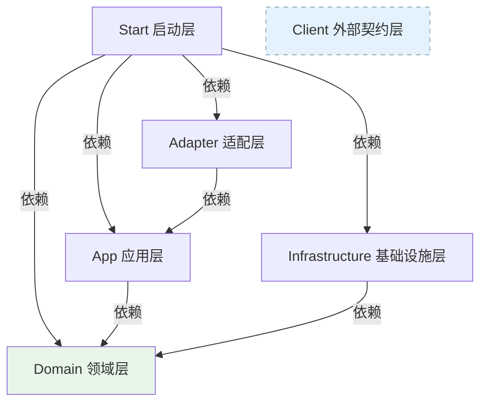
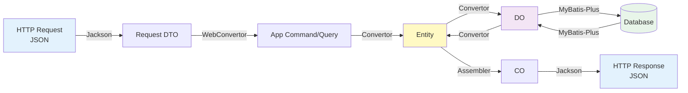

# midgard-backend-template

> 中庭 - 基于 COLA 5.0 的 DDD 架构模板项目

## 项目简介

Midgard（中庭）是基于 COLA 5.0 DDD 架构的微服务模板项目，用于快速创建符合 DDD 最佳实践的后端服务。

## 技术栈

- **基础框架**: Spring Boot 3.3.13 + Java 17
- **架构模式**: COLA 5.0 DDD 分层架构
- **服务注册**: Nacos 2.x
- **服务通信**: OpenFeign（对外）+ Dubbo 3.x（内部）
- **数据库**: MySQL 8.4 + MyBatis-Plus（使用 @AutoMybatis 自动生成 Mapper）
- **对象转换**: MapStruct
- **缓存**: Redis
- **消息队列**: Kafka / RocketMQ（可选）

## 架构设计

### 分层架构

```
┌─────────────────────────────────────────┐
│  Start（启动层）                         │  ← 启动 + 配置
├─────────────────────────────────────────┤
│  Adapter（适配层）                       │  ← 协议适配（HTTP、RPC、MQ）
├─────────────────────────────────────────┤
│  Client（客户端层）                      │  ← 对外契约
├─────────────────────────────────────────┤
│  App（应用层）                           │  ← 业务编排
├─────────────────────────────────────────┤
│  Domain（领域层）                        │  ← 业务规则
├─────────────────────────────────────────┤
│  Infrastructure（基础设施层）            │  ← 技术实现
└─────────────────────────────────────────┘
```

### 核心原则

| 层 | 职责 | 依赖 | 原则 |
|---|------|------|------|
| **Client** | 外部协议契约（Dubbo/Feign 接口与协议专属 DTO） | COLA 基础类 | 只定义不实现，独立于内部层 |
| **Adapter** | 协议适配（HTTP/RPC/MQ 等） | App | 薄适配层，不含业务逻辑 |
| **App** | 业务编排（AppService + CQRS 执行器） | Domain | 暴露 AppService，委派执行器，不放规则 |
| **Domain** | 业务规则（Entity、Repository 接口） | 无 | 规则中心，不依赖外部框架 |
| **Infrastructure** | 技术实现（DO、Repository 实现） | Domain | 实现 Domain 接口（依赖倒置） |
| **Start** | 启动配置 | 所有层 | 只做启动 + 配置 |

### 依赖关系



## 项目结构

### 各层子包说明

#### Client 层（`client`，外部协议契约，可选）

| 子包 | 用途 | 命名规范 |
|-----|------|---------|
| `api` | 对外协议接口（如 Dubbo/Feign） | `{Domain}Client` |
| `dto/*` | 协议专属 DTO（DubboRequest/FeignRequest 等） | 依协议命名 |

**注意**：内部编排 DTO 不放在 Client。

#### Adapter 层（`adapter`）

| 子包 | 用途 | 命名规范 |
|-----|------|---------|
| `web/customer` | Customer 领域 REST 控制器 | `{Domain}Controller` |
| `web/customer/dto` | Web 请求对象 | `{Verb}{Domain}Request` |
| `web/customer/convertor` | 请求转换器 | `{Domain}WebConvertor` |
| `rpc/provider` | RPC 服务提供者 | `{Domain}RpcProvider` |
| `mq/consumer` | MQ 消息消费者 | `{Domain}MqConsumer` |

#### App 层（`app`）

| 子包 | 用途 | 命名规范 |
|-----|------|---------|
| `{aggregate}` | 聚合根业务包 | 小写聚合名（如 `customer`） |
| `dto/cmd` | 命令对象（写） | `{Verb}{Domain}Cmd` |
| `dto/qry` | 查询对象（读） | `{Verb}{Domain}Qry` |
| `dto/co` | 客户对象（输出） | `{Domain}CO` |
| `dto/enums` | 业务枚举 | `{Name}Enum`、`ErrorCode` |
| `application` | AppService 接口/实现 | `{Domain}AppService` / `...Impl` |
| `executor` | 命令/查询执行器 | `{Domain}{Action}CmdExe`、`{Domain}{Action}QryExe` |
| `convertor` | Cmd→Entity 转换器 | `{Domain}Convertor` |
| `assembler` | Entity→CO 组装器 | `{Domain}Assembler` |
| `listener` | 事件监听器 | `{Domain}EventListener` |

#### Domain 层（`domain`）

| 子包 | 用途 | 命名规范 |
|-----|------|---------|
| `{aggregate}/model` | 领域模型 | `{Domain}`（Entity）、`{Name}`（VO） |
| `{aggregate}/service` | 领域服务 | `{Domain}DomainService` |
| `{aggregate}/repository` | 仓储接口 | `{Domain}Repository` |
| `{aggregate}/event` | 领域事件 | `{Domain}{Action}Event`（过去时） |

#### Infrastructure 层（`infrastructure`）

| 子包 | 用途 | 命名规范 |
|-----|------|---------|
| `persistence/dataobject` | 数据库对象 | `{Domain}DO` + `@AutoMybatis` |
| `persistence/convertor` | DO↔Entity 转换器 | `{Domain}Convertor` |
| `persistence/impl` | Repository 实现 | `{Domain}RepositoryImpl` |
| `gateway` | 第三方服务调用 | `{External}GatewayImpl` |
| `config` | 技术配置 | `{Tech}Config` |

## 对象转换链路



### 转换器职责

| 层 | 转换器 | 方向 | 工具 |
|---|--------|------|------|
| Adapter | `{Domain}WebConvertor` | Request → App Cmd | MapStruct |
| App | `{Domain}Convertor` | Cmd → Entity | MapStruct |
| App | `{Domain}Assembler` | Entity → CO | MapStruct |
| Infrastructure | `{Domain}Convertor` | Entity ↔ DO | MapStruct |

### 参数校验

1. **App 层 DTO**：使用 JSR 303 注解（`@NotBlank`、`@Size`、`@Pattern`）
2. **Adapter 层**：使用 `@Validated` + `@Valid` 启用校验
3. **Domain 层**：在 Entity 的 `validate()` 方法中校验业务规则

## 快速开始

### 开发流程

```bash
# 1. App 层 - 定义编排入口与内部 DTO
├── CustomerAppService / CustomerAppServiceImpl
├── dto/cmd/CreateCustomerCmd（带校验注解）
├── dto/qry/ListCustomerQry
├── dto/co/CustomerCO
├── executor/CustomerCreateCmdExe（@Transactional）
└── executor/CustomerListQryExe

# 2. Domain 层 - 定义模型
├── Customer Entity（含 validate() 方法）
└── CustomerRepository 接口

# 3. Infrastructure 层 - 技术实现
├── CustomerDO（@AutoMybatis 自动生成 Mapper）
├── CustomerInfraConvertor（DO ↔ Entity）
└── CustomerRepositoryImpl

# 4. Adapter 层 - 协议适配
├── CreateCustomerRequest
├── CustomerWebConvertor（Request → App Cmd）
└── CustomerController（@Validated，注入 CustomerAppService）

# 5. Client 层（可选）- 对外协议契约
└── Dubbo/Feign 接口与协议专属 DTO
```

## 常见问题

<details>
<summary><b>Q1: 为什么没有 Mapper 接口文件？</b></summary>

使用 `@AutoMybatis` 注解在编译期自动生成 Mapper 和 Service：

```java
@TableName("customer")
@AutoMybatis  // 自动生成 CustomerMapper 和 CustomerService
public class CustomerDO { }
```
</details>

<details>
<summary><b>Q2: Entity 与 DO 的区别？</b></summary>

- **Entity（领域实体）**：包含业务逻辑和行为方法
- **DO（数据对象）**：只包含数据字段，对应数据库表

通过 Convertor 转换，保持两者独立。
</details>

<details>
<summary><b>Q3: Convertor 与 Assembler 的区别？</b></summary>

- **Convertor**：Cmd → Entity（写入方向）
- **Assembler**：Entity → CO（读取方向）
</details>

<details>
<summary><b>Q4: 如何调用第三方服务？</b></summary>

使用 Gateway 模式：
1. Domain 层定义 Gateway 接口（如 `PaymentGateway`）
2. Infrastructure 层实现接口（如 `PaymentGatewayImpl`）
</details>

## 最佳实践

### ✅ 关键原则

- **依赖倒置**：Domain 定义接口，Infrastructure 实现
- **单一职责**：各层职责清晰，避免越界
- **事务边界**：在 App 层 Executor 上使用 `@Transactional`
- **参数校验**：Adapter 层 Request DTO 校验 + Domain 层业务规则
- **异常处理**：技术异常转换为领域异常

### 📚 详细文档

- 各包的 `package-info.java` 包含详细架构说明和代码示例
- `openspec/` 目录包含项目规范和设计文档

## 使用模板

```bash
# 1. 克隆项目
git clone <template-repo-url>

# 2. 修改包名
# 全局替换：io.yggdrasil.labs.midgard → io.your.company.yourservice

# 3. 修改项目名
# pom.xml: midgard-backend-template → your-service-name

# 4. 配置环境
# start/src/main/resources/application.yml

# 5. 启动项目
./mvnw spring-boot:run
```

## 相关资源

- [COLA 架构](https://github.com/alibaba/COLA)
- [阿里巴巴 Java 开发手册](https://github.com/alibaba/p3c)
- [MapStruct 文档](https://mapstruct.org/)
- [MyBatis-Plus 文档](https://baomidou.com/)

## 贡献指南

遵循 [Conventional Commits](https://www.conventionalcommits.org/) 规范：

```
feat: 新增功能
fix: 修复 Bug
docs: 文档更新
refactor: 代码重构
```

详细的自动化发布流程说明请参考 [工作流文档](.github/Workflow.md)。
