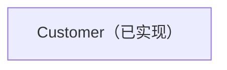

# 业务领域划分

本项目是基于 COLA 5.0 的 DDD 后端模板。当前已实现第一个业务聚合（Customer），用于展示完整的分层链路。

## 领域清单

| 领域 | 职责说明 | 代码位置 | 关键实体 |
|------|----------|----------|----------|
| Customer（客户） | 客户信息管理，包含创建、查询、更新、删除 | `domain/.../customer/` | Customer, CustomerStatus |

## Customer 聚合详情

### 领域模型

| 类型 | 类名 | 说明 |
|------|------|------|
| Entity | `Customer` | 聚合根，包含 name/email/phone/status |
| Value Object | `CustomerStatus` | 枚举：ACTIVE, INACTIVE |
| Repository | `CustomerRepository` | 持久化接口（save/findById/findAll/update/deleteById/existsByEmail——用于创建时唯一性校验） |

### 业务规则

- `validate()`：name 长度 2-50，email 符合标准格式
- `initForCreate()`：新建客户默认状态为 ACTIVE

### 数据库映射

- 表名：`customer`
- 迁移脚本：`V1__create_customer.sql`
- 唯一约束：email（idx_email）
- 索引：status（idx_status）

### 各层实现状态

| 层 | 状态 | 说明 |
|----|------|------|
| domain | ✅ 完成 | Entity + VO + Repository 接口 + 业务规则 |
| infrastructure | ✅ 完成 | Repository 实现 + DO + InfraConvertor |
| app | ✅ 完成 | AppService + CmdExe/QryExe + DTO |
| adapter | ✅ 完成 | REST Controller + Request DTO + Convertor |
| client | ✅ 完成 | 跨服务契约 DTO |
| 迁移 | ✅ 完成 | Flyway V1 脚本就位 |

## 领域间关系

> 当前仅有单一聚合，无跨聚合依赖。引入第二个聚合时在此注册关系。

## 领域通信规则

- 领域之间不允许循环依赖
- 跨领域通信只能通过 App 层 Service 编排
- Domain 层不感知其他聚合的内部实现
