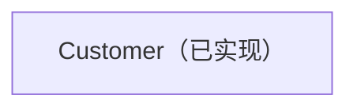

# 业务领域划分

本项目是基于 COLA 5.0 的 DDD 后端模板。当前已实现第一个业务聚合（Customer），用于展示完整的分层链路。

## 领域清单

| 领域 | 职责说明 | 代码位置 | 关键实体 |
|------|----------|----------|----------|
| Customer（客户） | 客户信息管理，包含创建、查询、更新、删除 | `domain/.../customer/` | Customer, CustomerStatus |

## Customer 聚合详情

### 领域模型

| 类型 | 类名 | 说明 |
|------|------|------|
| Entity | `Customer` | 聚合根，包含 name/email/phone/status |
| Value Object | `CustomerStatus` | 枚举：ACTIVE, INACTIVE |
| Repository | `CustomerRepository` | 持久化接口（save/findById/findAll/update/deleteById/existsByEmail——用于创建时唯一性校验） |
| 错误定义 | `CustomerErrorCode` | 21001 邮箱重复；21002 仅定义及映射，真实版本冲突尚未实现 |

### 业务规则

- `validate()`：name 非空白且长度 2-50，email 符合现有格式且不超过 100，phone 可选且不超过 20
- `initForCreate()`：新建客户默认状态为 ACTIVE
- HTTP 创建/更新请求通过字段和对象级校验；直接调用由 App/Domain 防线保护。更新的 null 表示不修改，电话空串可清空。
- 错误与分页信封统一为 Mimir R，字段和状态码以 [HTTP API 契约](design-docs/arch-api-contract.md) 为准；不再维护本地 GlobalExceptionHandler/ErrorResponse。

### 数据库映射

- 表名：`customer`
- 唯一迁移源：[Start 模块的 V1](../start/src/main/resources/db/migration/V1__create_customer.sql)，由应用配置中的 Flyway `classpath:db/migration` 加载；维护方式见[数据库迁移规则](engineering/development.md#数据库迁移)
- 唯一约束：email（idx_email）
- 索引：status（idx_status）
- 仓储仅将可识别的 idx_email 重复键错误翻译为 21001；不改变 SQL、更新影响行数或表结构。
- App 使用同一组 PageRequest 纠正值调用现有 findAll/count 并返回 PageResult；单次分页查询及 version 仍为后续需求。

### 各层实现状态

| 层 | 状态 | 说明 |
|----|------|------|
| domain | ✅ 完成 | Entity + VO + Repository 接口 + 业务规则 |
| infrastructure | ✅ 完成 | Repository 实现 + DO + InfraConvertor |
| app | 已实现 | AppService + Cmd/Qry/CO + Convertor/Assembler；当前未拆分 CmdExe/QryExe |
| adapter | ✅ 完成 | REST Controller + Request DTO + Convertor |
| client | 预留 | 当前只有 package-info，尚无跨服务接口与契约 DTO |
| 迁移 | ✅ 完成 | Flyway V1 脚本就位 |

表中状态仅描述源码落点。项目只维护单元/standalone/架构测试；真实应用、数据库、并发与前端消费证据单独说明，不能由隔离测试结果推断。

## 领域间关系

```mermaid
flowchart LR
  Customer["Customer（已实现）"]
```

> 当前仅有单一聚合，无跨聚合依赖。引入第二个聚合时在此注册关系。

## 领域通信规则

- 领域之间不允许循环依赖
- 跨领域通信只能通过 App 层 Service 编排
- Domain 层不感知其他聚合的内部实现
