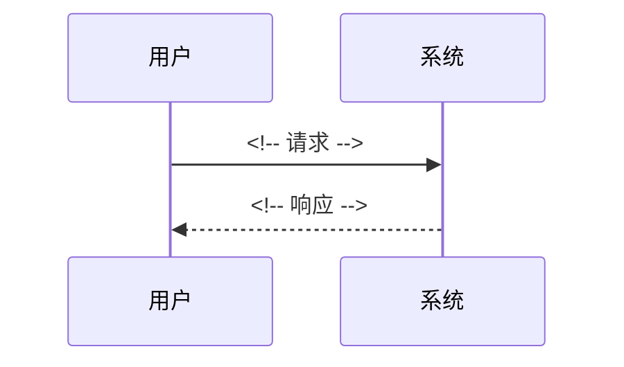

# 设计文档：{slug}

## 背景

<!-- 从 spec 概括动机，一段话。 -->

## 技术方案

### 数据模型

<!-- 新增/修改的实体、字段、关系。 -->

### 接口契约

<!-- API 端点 / 函数签名 / 消息格式。 -->

### 核心流程

## 影响范围

| 模块/文件 | 变更类型 | 说明 |
|-----------|----------|------|
| <!-- 路径 --> | 新增 / 修改 / 删除 | <!-- --> |

## 约束

- <!-- 产品约束：继承自 spec -->
- <!-- 技术约束 -->
- <!-- 性能约束 -->

## 迁移与兼容

- **Schema migration**：<!-- 不适用 / 迁移脚本路径 -->
- **数据回填**：<!-- 不适用 / 策略 -->
- **向后兼容**：<!-- 处理方式 -->
- **Feature flag**：<!-- 不使用 / flag 名称 -->

## 发布与回滚

- **发布策略**：<!-- 全量 / 灰度 / 分批 -->
- **回滚方案**：<!-- -->
- **回滚触发条件**：<!-- -->

## 观测性

- **关键指标**：<!-- -->
- **告警规则**：<!-- -->
- **日志/追踪**：<!-- -->

## 异常处理

| 场景 | 技术处理方式 |
|------|-------------|
| <!-- --> | <!-- 重试 / 降级 / 报错 / 熔断 --> |

## 验证方式

- 单元测试：<!-- -->
- 集成测试：<!-- -->
- 性能测试：<!-- -->

## 备选方案

| 方案 | 优势 | 否决原因 |
|------|------|----------|
| <!-- --> | <!-- --> | <!-- --> |
